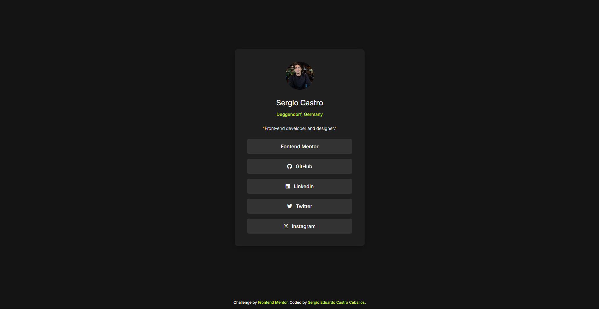

# Frontend Mentor - Social links profile solution

This is a solution to the [Social links profile challenge on Frontend Mentor](https://www.frontendmentor.io/challenges/social-links-profile-UG32l9m6dQ). Frontend Mentor challenges help you improve your coding skills by building realistic projects.

## Table of contents

- [Overview](#overview)
  - [The challenge](#the-challenge)
  - [Screenshot](#screenshot)
  - [Links](#links)
- [My process](#my-process)
  - [Built with](#built-with)
  - [Useful resources](#useful-resources)
- [Author](#author)

## Overview

### The challenge

Users should be able to:

- See hover and focus states for all interactive elements on the page

### Screenshot

### Links

- Solution URL: [Frontend Mentor Solution](https://www.frontendmentor.io/solutions/responsive-social-media-sharing-component-with-scss-I-xhUbZNj7)
- Live Site URL: [Netlify](https://fm-social-links-challenge-sergio.netlify.app/)

## My process

1. Analyze the designs
2. Implement my CSS reset code
3. Add all the root/global values as well as any utility class I might need
  3.1 Create the fluid typography
4. Create the structure in the html files (utilizing the BEM methodology)
5. Add the section/component specific styling

### Built with

- Semantic HTML5 markup
- CSS custom properties
- Flexbox
- Mobile-first workflow
- Scss
- Fluid Typography with clamp

### Useful resources

- [Fluid Typography Calculator](https://royalfig.github.io/fluid-typography-calculator/) - This website is always a great help when creating your fluid typography.
- [CSS Scan - Beautiful CSS box-shadow examples](https://getcssscan.com/css-box-shadow-examples) - Good website to use for box shadow styling ideas.
- [Font Awesome](https://fontawesome.com/) - Amazing website for icons.
- [Google Fonts](https://fonts.google.com/) - Best website for web fonts.

## Author

- Website - [Sergio Eduardo Castro Ceballos](https://sergiocas.com/)
- Frontend Mentor - [@SergioCasCeb](https://www.frontendmentor.io/profile/SergioCasCeb)
- LInkedIn- [Sergio Eduardo Castro Ceballos](www.linkedin.com/in/sergio-eduardo-castro-ceballos)
